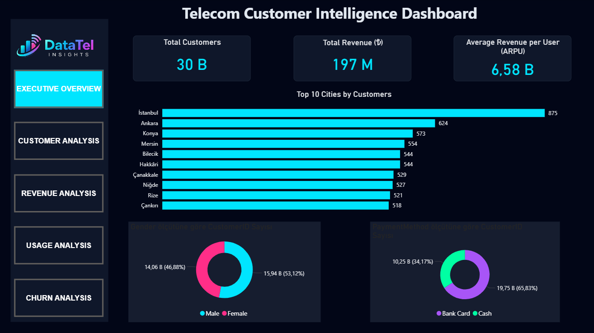
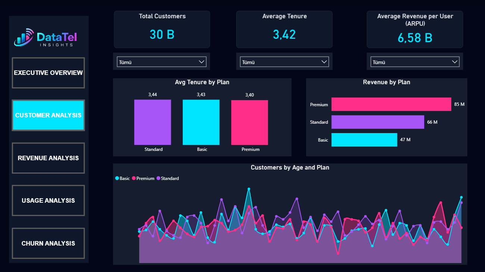
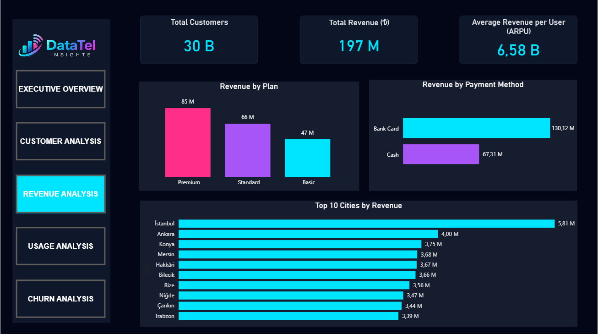
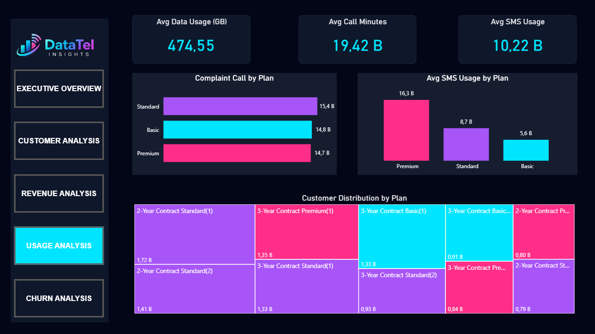
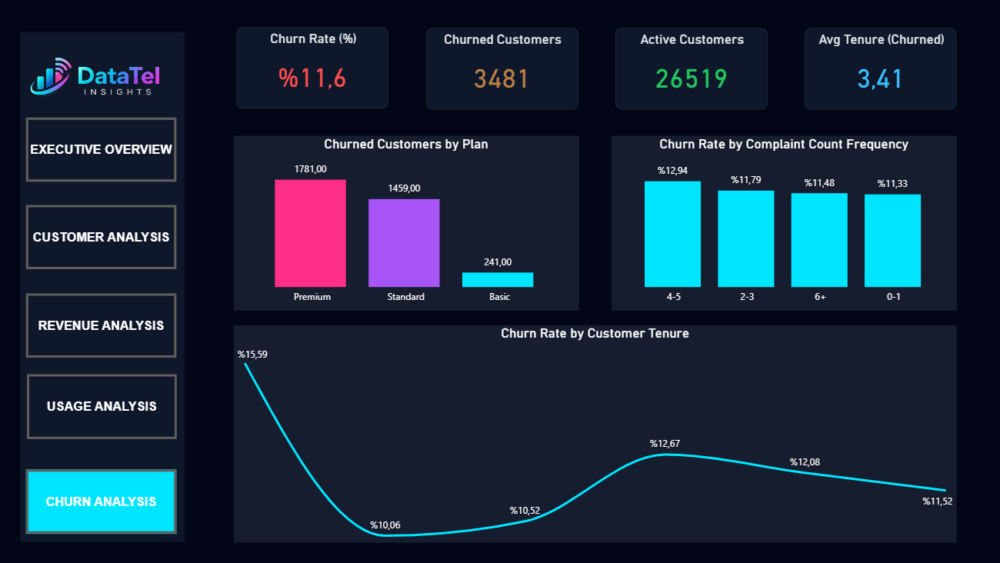

# 📊 Telecom Customer Churn Analysis Dashboard

## 📌 Project Overview
This project analyzes customer churn behavior in a telecom company using Power BI.

## 🎯 Objectives
- Identify key factors driving customer churn
- Analyze churn by plan, tenure, and customer behavior
- Provide actionable insights for retention strategies

## 📊 Dashboard Features
- Churn Rate KPI
- Churned vs Active Customers
- Churn by Plan
- Churn by Customer Tenure
- Churn by Complaint Frequency

## 🛠️ Tools Used
- Power BI
- DAX
- Data Modeling

## 📸 Dashboard Preview

## 📈 Key Insights
- Premium plan customers have higher churn volume
- Customers with more complaints are more likely to churn
- New customers show higher churn tendency

## 📥 Download the Dashboard
Due to file size limitations, the Power BI (.pbix) file cannot be previewed on GitHub. Please download the file to view it locally.

  
  
  
  
  

